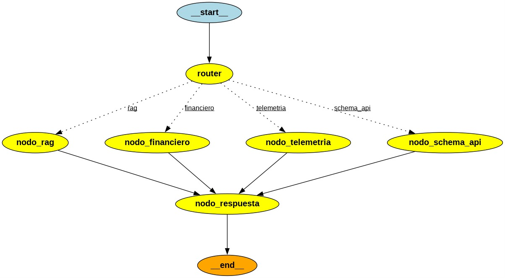

# 🏭 Industrial RAG Router

<p align="center">


</p>

> **Industrial AI platform based on Retrieval-Augmented Generation (RAG) and LangGraph that intelligently routes user queries to specialized AI agents for technical documentation, telemetry, financial analysis and API schemas.**

---

# Overview

Industrial RAG Router is a modular **multi-agent Retrieval-Augmented Generation (RAG)** system designed for industrial environments.

Instead of relying on a single Large Language Model, the platform classifies each incoming query and routes it to a specialized AI agent capable of solving a specific task.

The system combines:

- 🧠 Intelligent query routing
- 📄 Semantic document retrieval
- 🤖 Specialized AI agents
- ⚡ High-speed inference with Groq
- 🗂️ Vector search using FAISS
- 🔄 Workflow orchestration with LangGraph

The architecture is modular, scalable, and designed to easily incorporate additional agents or knowledge sources.

---

# ✨ Features

- Multi-Agent Architecture
- Intelligent Query Routing
- Retrieval-Augmented Generation (RAG)
- LangGraph Workflow Orchestration
- Semantic Search with FAISS
- PDF Knowledge Base
- Conversational Memory
- Modular Node Design
- Environment-based Configuration
- Easily Extensible

---

# 🏗 Architecture

The application is orchestrated by **LangGraph**.

Each user query is first analyzed by the **Router**, which determines which specialized agent should process it.

```
                 User Question
                       │
                       ▼
                 Query Router
                       │
     ┌─────────┬────────────┬──────────────┬
     ▼         ▼            ▼              ▼
   RAG      Financial   Telemetry     Schema API
   Agent      Agent        Agent          Agent
     │         │            │              │
     └─────────┴────────────┴──────────────┘
                       │
                       ▼
              Response Generator
                       │
                       ▼
                    Final Answer
```

---

## LangGraph Workflow

<p align="center">
    
</p>

---

#  Components

| Component | Description |
|------------|-------------|
| **Router** | Determines which specialized agent should handle the request. |
| **RAG Node** | Retrieves information from indexed industrial documentation. |
| **Financial Node** | Handles financial and budgeting related questions. |
| **Telemetry Node** | Processes industrial telemetry and sensor-related queries. |
| **Schema API Node** | Answers questions about API schemas and endpoints. |
| **Response Node** | Standardizes and formats the final response. |

---

#  Technology Stack

| Category | Technologies |
|----------|--------------|
| Language | Python |
| LLM | Groq |
| Framework | LangGraph |
| RAG | LangChain |
| Vector Store | FAISS |
| Embeddings | Sentence Transformers |
| UI | Streamlit |
| Documents | PDF |
| Data | Pandas |
| Environment | python-dotenv |

---

# 📂 Project Structure

```text
industrial-rag-router/

├── data/
│   ├── documents/
│   └── vectorstore/
│
├── docs/
│   └── images/
│       └── langgraph_workflow.png
│
├── src/
│   ├── graph/
│   │   ├── router.py
│   │   ├── state.py
│   │   └── graph.py
│   │
│   ├── nodes/
│   │   ├── nodo_rag.py
│   │   ├── nodo_financiero.py
│   │   ├── nodo_telemetria.py
│   │   ├── nodo_schema_api.py
│   │   └── nodo_respuesta.py
│   │
│   ├── services/
│   ├── utils/
│   └── prompts/
│
├── app.py
├── requirements.txt
└── README.md
```

---

#  Installation

Clone the repository.

```bash
git clone https://github.com/JCaceres-R/industrial-rag-router.git

cd industrial-rag-router
```

Create a virtual environment.

```bash
python -m venv .venv
```

Activate it.

### Windows

```bash
.venv\Scripts\activate
```

### Linux / macOS

```bash
source .venv/bin/activate
```

Install dependencies.

```bash
pip install -r requirements.txt
```

---

# 🔑 Environment Variables

Create a `.env` file.

```env
GROQ_API_KEY=

GROQ_MODEL=

EMBEDDING_MODEL=

VECTOR_DB_PATH=
```

---

# ▶️ Running

```bash
streamlit run app.py
```

---

# 🔄 Query Flow

```
User Question

      │

      ▼

Query Classification

      │

      ▼

Agent Selection

      │

      ▼

Knowledge Retrieval (optional)

      │

      ▼

LLM Reasoning

      │

      ▼

Response Formatting

      │

      ▼

Final Answer
```

---

# 🚀 Roadmap

- [x] Multi-Agent Architecture
- [x] LangGraph Workflow
- [x] Intelligent Router
- [x] RAG Integration
- [x] FAISS Vector Database
- [x] Semantic Retrieval
- [x] Modular Nodes

Future improvements:

- [ ] Docker Support
- [ ] PostgreSQL Persistence
- [ ] Hybrid Search
- [ ] OCI Deployment
- [ ] REST API
- [ ] Authentication
- [ ] Agent Monitoring
- [ ] Observability with LangSmith

---

# 🤝 Contributing

Contributions, issues and feature requests are welcome.

Feel free to open an issue or submit a pull request.

---

# 📜 License

This project is licensed under the MIT License.

---

# 👨‍💻 Author

**Johan Sebastián Cáceres Rodríguez**

Electronic Engineer • AI Engineer • Data & AI Engineering

- 💼 LinkedIn: [*LinkedIn*](https://www.linkedin.com/in/johan-sebastian-caceres-rodriguez-5b19a135b)
- 🐙 GitHub: https://github.com/JCaceres-R

---

⭐ If you found this project useful, consider giving it a star!
